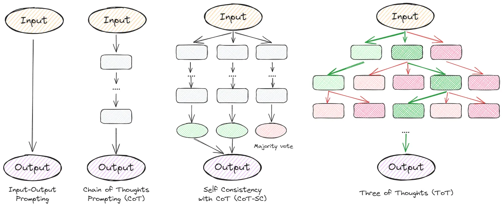
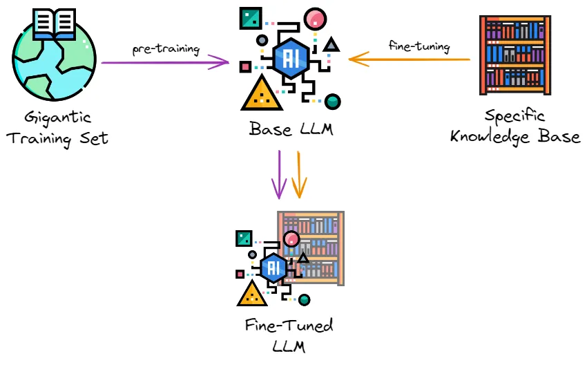
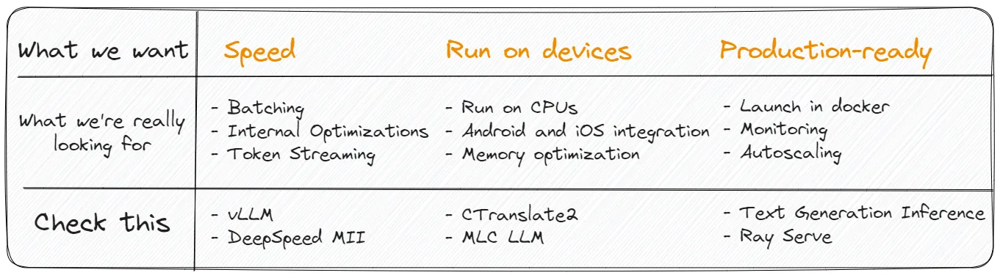
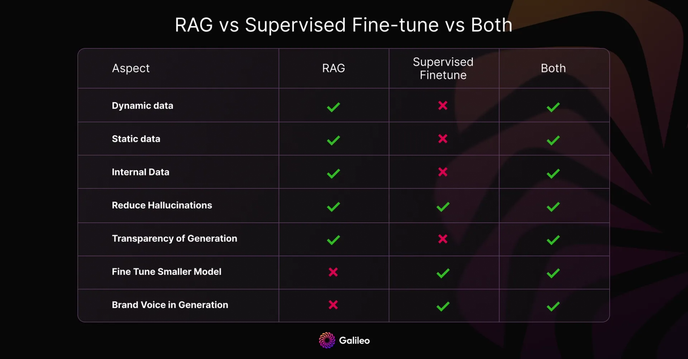
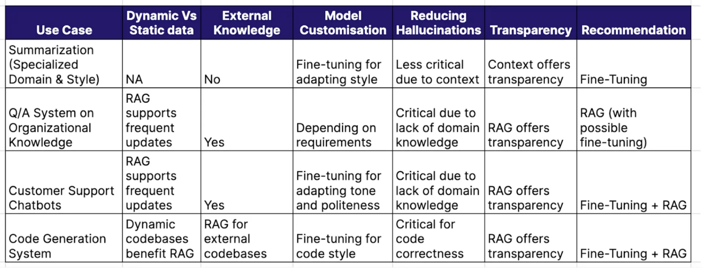

## LLM & GPT
-   LLMs are AI models that use the “transformer” architecture to learn and generate text. They aren’t specifically programmed but learn from data.
-    The attention mechanism allows the model to understand the relationships between words, sentences, and paragraphs, and thus, grasp the deep meaning of a text.
-    Context is like constraint such as maximum number of words in response. Works on token instead of words , token can be small as word , here in ChatGpt , one token can be chat and other can be GPT.
-    Contex is resource intensive.(can take lot of memory)
-    32,768 tokens (about 25,000 words) for GPT-4 
-    Generative Pre-trained Transformers
-    Large Language Models - is a neural network model that predicts the next token based on the previously predicted one. 
-    Popular Open Source models
                - LLaMA-2 by Meta
                - Falcon by Technology Innovation Institute in Abu Dhabi
                - Mistral by Mistral AI
- Prompting
    - 
- Retrieval Augmented Generation (RAG) - LLM with external knowledge base.
This allows the model to add relevant information or specific data not included in the original training set to the model.

    - when to use RAG
      - Need of Current Information
      - Domain Specific Application (when required knowledge outside the LLM)
- A summarized image
    
  
- Deployment of LLM
  - 

## LLMs are Zero Shots Reasoners
- The method of conditioning the language model is called “prompting”.
- Zero-Shot Prompting 
  - Directly prompting the model without example or demo.
- Few Shot Prompting
  -  Providing examples/demos along with prompts
- Chain of Thought
  - Multi-step arithmetic and logical reasoning benchmarks have particularly challenged the scaling laws of large language models
- Zero-Shot-COT
  - template-based prompting for chain of thought reasoning
  - does not require step by step prompting
  - it is inherently task-agnostic and elicits multi-hop reasoning across a wide range of tasks with a single template

## 22.03.24
- Installing grok today

## 27.03.24
# RAG & Fine Tuning
- Fine Tuning is all about pretraining and data being trained / static data.
- RAG : LLM to external knowledge through retrival mechanisms / dynimal data.
-  
- RAG offers agility and up-to-date responses in rapidly evolving data landscapes, making it ideal for projects with dynamic information needs.
- Fine-tuning allows you to adapt an LLM's behavior, writing style, or domain-specific knowledge to specific nuances, tones, or terminologies.
- RAG : not for smaller models , Fine tuning can do it very well.
- Where to Apply what?:
     

## RAG
- LlamaIndex 
  -  one can a context augmentation pattern called Retrieval-Augmented Generation (RAG)to obtain more accurate text generation relevant to your specific data
  -  No expensive training
  -  always up to date.
  -  LlamaIndex imposes no restriction on how you use LLMs.
  -  Make LLM more relavant to you
  -  pip install llama-index 
