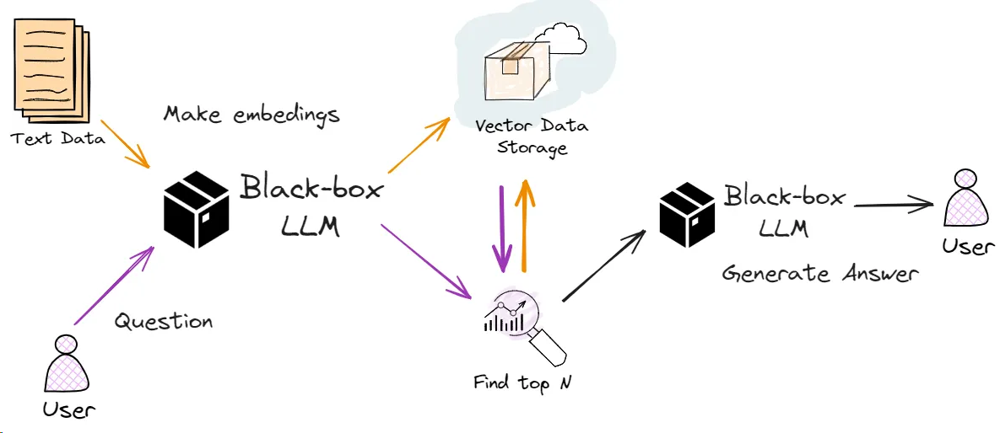

## LLM & GPT
-   LLMs are AI models that use the “transformer” architecture to learn and generate text. They aren’t specifically programmed but learn from data.
-    The attention mechanism allows the model to understand the relationships between words, sentences, and paragraphs, and thus, grasp the deep meaning of a text.
-    Context is like constraint such as maximum number of words in response. Works on token instead of words , token can be small as word , here in ChatGpt , one token can be chat and other can be GPT.
-    Contex is resource intensive.(can take lot of memory)
-    32,768 tokens (about 25,000 words) for GPT-4 
-    Generative Pre-trained Transformers
-    Large Language Models - is a neural network model that predicts the next token based on the previously predicted one. 
-    Popular Open Source models
                - LLaMA-2 by Meta
                - Falcon by Technology Innovation Institute in Abu Dhabi
                - Mistral by Mistral AI
- Prompting
    - 
- Retrieval Augmented Generation (RAG) - LLM with external knowledge base.
This allows the model to add relevant information or specific data not included in the original training set to the model.

    - when to use RAG
      - Need of Current Information
      - Domain Specific Application (when required knowledge outside the LLM)
- A summarized image
    
  
- Deployment of LLM
  - 

- 